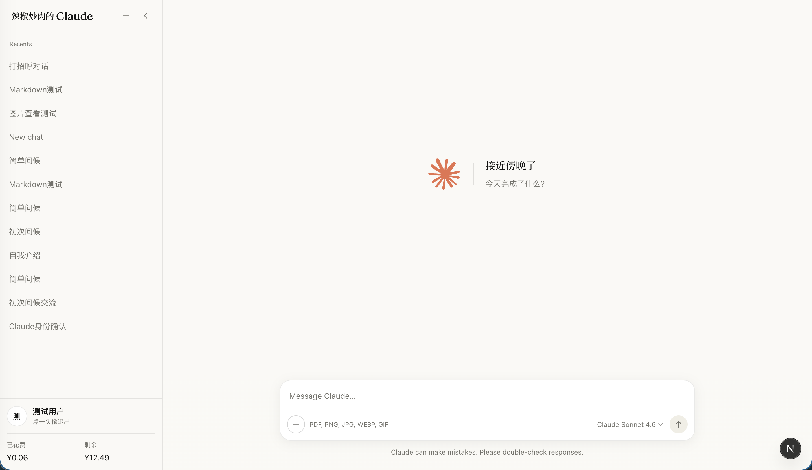
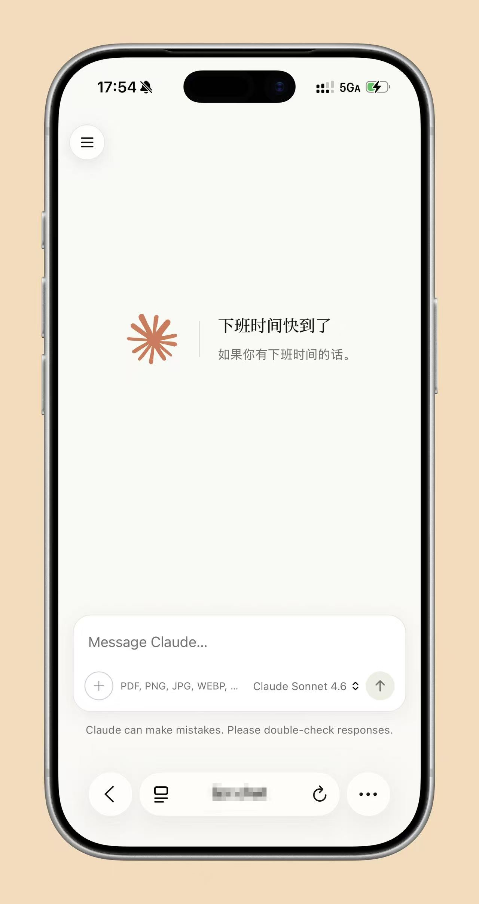

# Claude Clone

一个仿照 Claude Web UI 复刻的前端界面，基于 Next.js 16 + React 19 构建。支持多用户、流式对话、额度追踪和时间问候动画。

可接入兼容 Claude 原生 API 格式的后端（如 [gpt.ge](https://api.v3.cm/panel) 等代理服务）。

## 界面预览

### 桌面端


### 移动端


## 技术栈

| 层 | 技术 |
|---|------|
| 框架 | Next.js 16.2 (Turbopack) |
| UI | React 19 + Tailwind CSS 4 |
| Markdown | react-markdown + remark-gfm |
| 部署 | Vercel |

## 快速开始

### 1. 克隆项目

```bash
git clone https://github.com/may3rr/claude-clone.git
cd claude-clone
npm install
```

### 2. 配置环境变量

复制 `.env.example` 并填入你的配置：

```bash
cp .env.example .env.local
```

```env
# API 端点（兼容 Claude 原生格式的代理地址）
GPT_GE_API_URL=https://api.gpt.ge/v1/messages

# 用户 API Key 映射（KEY_ + 用户缩写大写）
KEY_ZHANGSAN=sk-xxx
KEY_LISI=sk-xxx
```

### 3. 配置用户

编辑 `src/config/users.json`：

```json
{
  "users": [
    { "shortname": "zhangsan", "displayName": "张三" },
    { "shortname": "lisi", "displayName": "李四" }
  ]
}
```

- `shortname` — 登录用缩写（小写），同时决定环境变量名 `KEY_ZHANGSAN`
- `displayName` — 侧栏显示的名称

### 4. 启动

```bash
npm run dev
```

打开 http://localhost:3000，输入用户缩写登录。

## 部署到 Vercel

1. 将项目推送到 GitHub
2. 在 [Vercel](https://vercel.com) 导入项目
3. 在 Settings → Environment Variables 中添加 `GPT_GE_API_URL` 和每个用户的 `KEY_XXX`
4. 部署完成

或使用 CLI：

```bash
npm i -g vercel
vercel deploy --prod
```

## 项目结构

```
src/
├── app/
│   ├── page.tsx                 # 首页（问候 + 输入框）
│   ├── chat/[id]/page.tsx       # 对话页
│   ├── login/page.tsx           # 登录页
│   ├── api/chat/route.ts        # 对话 API（转发到后端）
│   ├── api/billing/summary/     # 额度查询 API
│   ├── layout.tsx               # 根布局（侧栏 + 主区域）
│   └── globals.css              # 全局样式 + 主题变量
├── components/
│   ├── welcome/WelcomeHero.tsx   # 时间问候动画
│   ├── input/ChatInput.tsx       # 输入框（IME 友好）
│   ├── chat/                     # 消息列表、气泡、思考动画
│   ├── sidebar/                  # 侧栏、对话列表、用户面板
│   └── icons/                    # SVG 图标
├── lib/
│   ├── auth.ts                   # 用户认证 + API Key 映射
│   ├── billing.ts                # 额度计算（USD → CNY）
│   ├── billing-events.ts         # 额度刷新事件系统
│   ├── chat-storage.ts           # 对话本地持久化
│   └── users.ts                  # 用户配置读取
└── config/
    └── users.json                # 用户列表
```

## 添加新用户

1. 在 `src/config/users.json` 添加一条记录
2. 添加环境变量 `KEY_<缩写大写>=<API Key>`（本地加到 `.env.local`，Vercel 加到 Environment Variables）
3. 重新部署

## 自定义

### 修改模型列表

编辑 `src/components/input/ChatInput.tsx` 中的 `MODEL_LABELS`：

```typescript
const MODEL_LABELS: Record<string, string> = {
  'claude-sonnet-4-6': 'Claude Sonnet 4.6',
  'claude-opus-4-6': 'Claude Opus 4.6',
  // 添加更多模型...
};
```

### 修改问候语

编辑 `src/components/welcome/WelcomeHero.tsx` 中的 `GREETINGS` 对象。

### 调整 API 参数

编辑 `src/app/api/chat/route.ts` 中的 `max_tokens`、`temperature` 等参数。

## License

MIT
